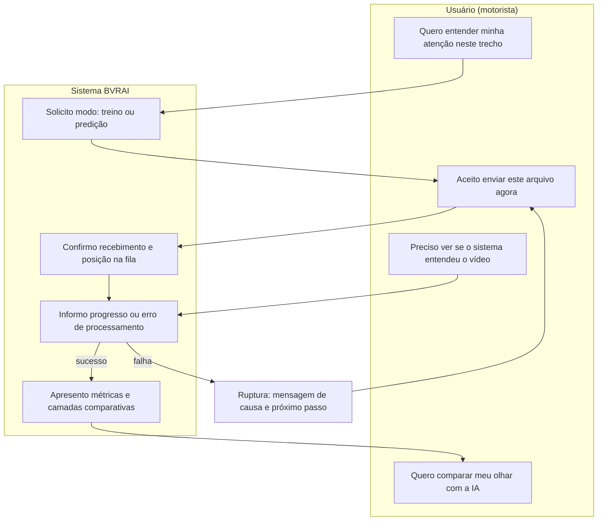

# Diagrama MOLIC

O **MOLIC** (*Model of Interaction as Conversation*) descreve a interação como troca de intenções entre usuário e sistema, incluindo rupturas e retomadas. Abaixo, versão condensada do fluxo principal de **envio de vídeo para predição** e leitura de resultado no BVRAI.

## Diagrama (visão conversacional)

## Comentário estrutural

- **Abertura:** o sistema explicita o **modo** de uso para evitar expectativa incorreta sobre o que será feito com o vídeo.  
- **Meio:** a conversa permanece no registro de **estado** até que o processamento assíncrono conclua; silêncio prolongado é tratado como risco de ruptura.  
- **Encerramento:** a camada comparativa fecha o ciclo com resposta à intenção inicial de “entender atenção”.

---

*Referência: BARBOSA, S. D. J.; SILVA, B. S. **Interação Humano-Computador**. Elsevier, 2010.*
