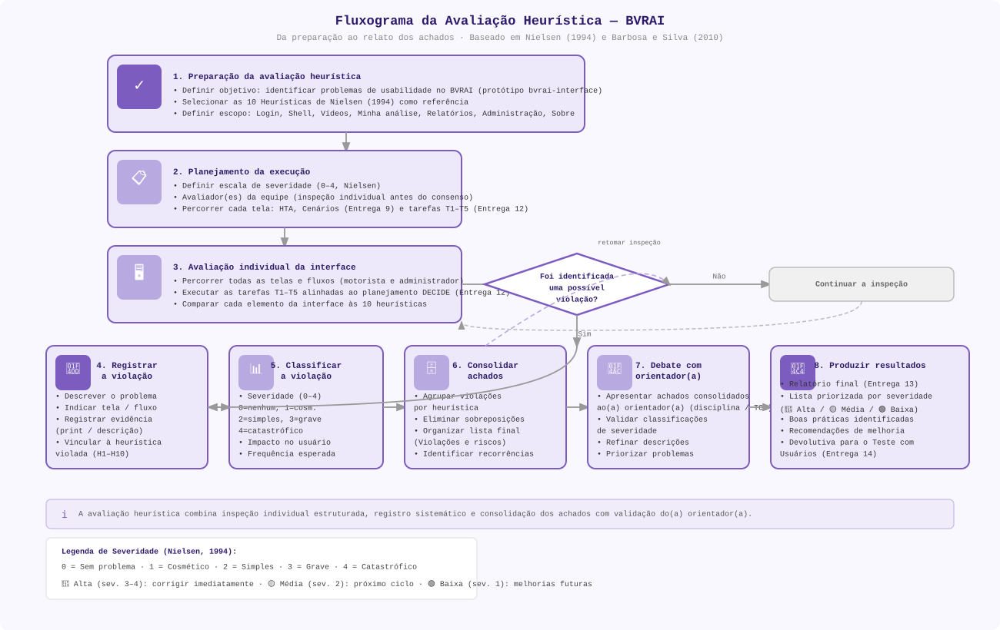

# Fluxo da avaliação heurística

A avaliação heurística do **BVRAI** segue o mesmo desenho visual do fluxograma do projeto **Balbine/GAIA**: passos verticais de preparação e inspeção, **losango** de decisão (“há violação?”), ramo “Não” para continuar a inspeção, sequência horizontal **registrar → classificar → consolidar → debate → resultados**, rodapé explicativo e **legenda de severidade** Nielsen (1994). O arquivo SVG reproduz a paleta lavanda, caixas arredondadas e ícones, adaptado ao escopo e às entregas do BVRAI.

## Fluxograma (gráfico)

*Arquivo editável: [`assets/fluxograma-avaliacao-heuristica-bvrai.svg`](./assets/fluxograma-avaliacao-heuristica-bvrai.svg). Modelo alinhado ao fluxograma GAIA em `balbine/ihc_gaia/assets/entrega13_fluxograma.svg`.*

## Resumo dos passos

| # | Etapa | Foco no BVRAI |
| :-: | :--- | :--- |
| 1 | Preparação | Objetivo, 10 heurísticas, escopo das telas (Login … Sobre). |
| 2 | Planejamento da execução | Escala 0–4; avaliador(es) com inspeção individual; HTA, Cenários (9), T1–T5 (12). |
| 3 | Avaliação individual | Fluxos motorista e admin; comparação sistemática com H1–H10. |
| — | Decisão | Se não há violação, **continuar** a inspeção (seta tracejada ao passo 3). |
| 4–6 | Registrar, classificar, consolidar | Evidências, severidade, lista unificada (ver [Violações e riscos](./Violações%20e%20riscos.md)). |
| — | Retomar (opcional) | Após consolidar um achado, pode-se **retomar a inspeção** (seta tracejada lilás ao losango), como no diagrama de referência. |
| 7 | Debate com orientador(a) | Validar severidades e prioridades antes do fechamento. |
| 8 | Produzir resultados | Documentação da Entrega 13 e insumos para o teste com usuários (Entrega 14). |

---

*Referência: NIELSEN, J. **Enhancing the explanatory power of usability heuristics**. Proc. CHI, 1994. | BARBOSA, S. D. J.; SILVA, B. S. **Interação Humano-Computador**. Elsevier, 2010.*
