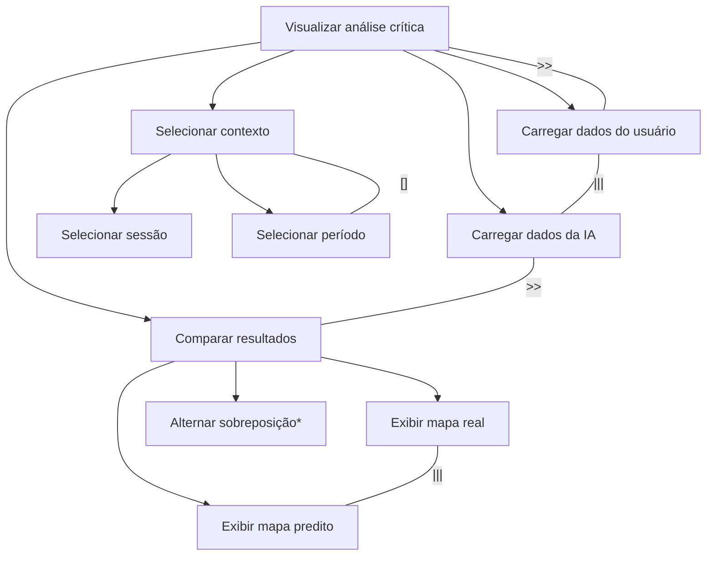
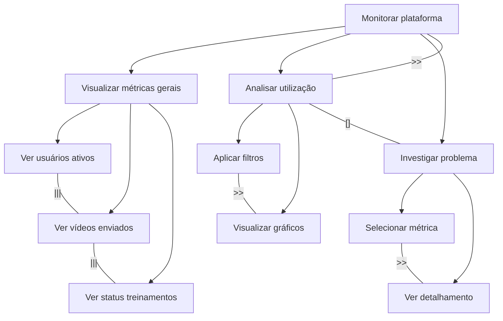
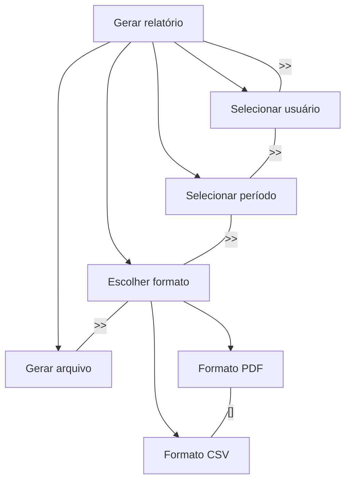
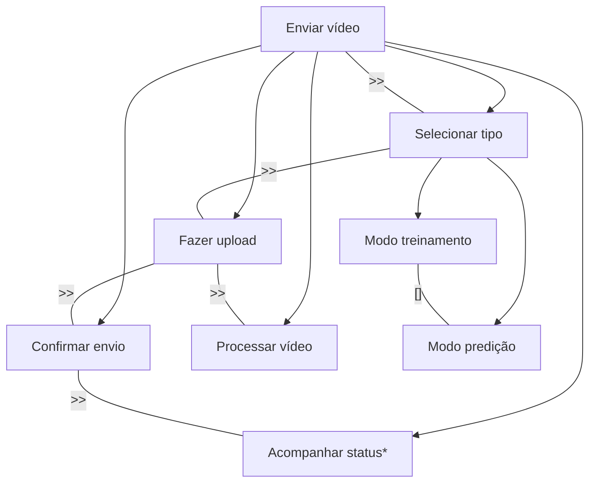

# Modelagem CTT – ConcurTaskTrees

---

## 1. CTT – Dashboard de Análise Crítica Individual

---

## 2. CTT – Dashboard do Administrador

---

## 3. CTT – Extração de Relatório Individual

---

## 4. CTT – Enviar Vídeo para Processamento

