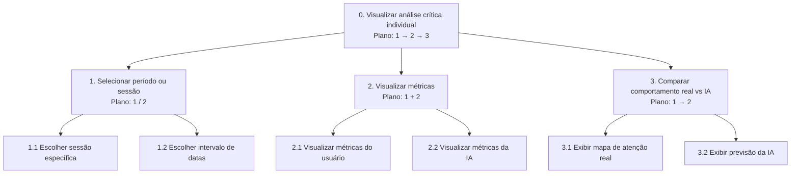
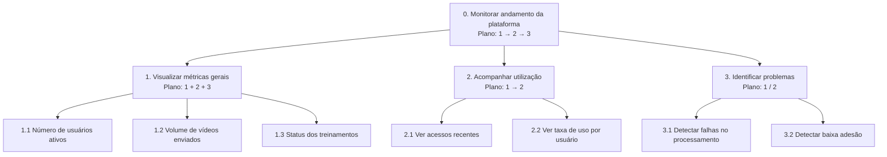
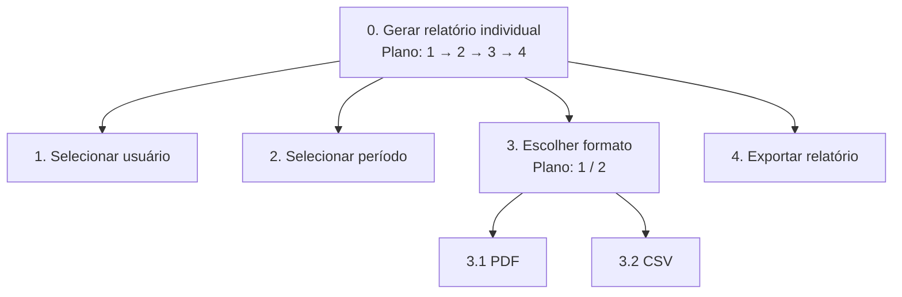
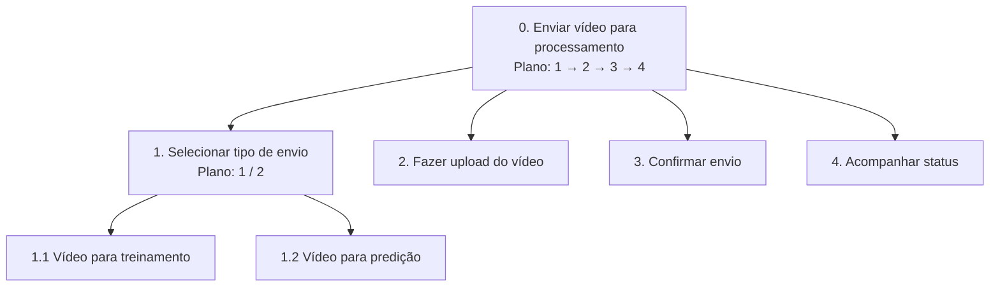

# 1️⃣ Dashboard de Análise Crítica Individual

🎯 **Objetivo**  
Permitir que o usuário visualize e compare seu comportamento real com a predição da IA.

| Objetivos / operações | Problemas e recomendações |
| :--- | :--- |
| **0. Visualizar análise crítica individual** `1 > 2 > 3` | **Entrada:** credenciais válidas e vídeo já processado. **Feedback:** painel com métricas, heatmaps e indicadores comparativos. **Plano:** definir recorte temporal ou sessão; consultar métricas; confrontar olhar real e predição. **Recomendação:** manter legenda fixa diferenciando camadas “real” e “IA”. |
| **1. Selecionar período ou sessão** `1 / 2` | **Plano:** ou escolher uma sessão pontual ou um intervalo de datas. |
| **1.1. Escolher sessão específica** *(operação)* | **Ação:** selecionar item na lista ou carrossel de sessões. **Problema:** muitas sessões sem busca dificultam localização. **Recomendação:** campo de busca e ordenação por data. |
| **1.2. Escolher intervalo de datas** *(operação)* | **Ação:** definir data inicial e final no filtro. **Problema:** intervalos amplos sobrecarregam gráficos. **Recomendação:** aviso de desempenho e sugestão de limite máximo. |
| **2. Visualizar métricas** `1 + 2` | **Plano:** inspecionar métricas do usuário e da IA em paralelo. |
| **2.1. Visualizar métricas do usuário** *(operação)* | **Ação:** ler cards e gráficos derivados do vídeo real. **Feedback:** valores e tendências atualizados conforme filtro. |
| **2.2. Visualizar métricas da IA** *(operação)* | **Ação:** ler projeções do modelo treinado. **Problema:** jargão técnico reduz compreensão. **Recomendação:** glossário embutido ou tooltips em linguagem acessível. |
| **3. Comparar comportamento real vs IA** `1 > 2` | **Plano:** exibir mapa de atenção real; em seguida exibir previsão. |
| **3.1. Exibir mapa de atenção real** *(operação)* | **Ação:** ativar visualização do heatmap/regiões de fixação reais. |
| **3.2. Exibir previsão da IA** *(operação)* | **Ação:** sobrepor ou alternar camada de predição. **Problema:** sobreposição excessiva confunde leitura. **Recomendação:** controle deslizante ou botão de alternância entre camadas. |

---

# 2️⃣ Dashboard do Administrador

🎯 **Objetivo**  
Monitorar o andamento e utilização da plataforma.

| Objetivos / operações | Problemas e recomendações |
| :--- | :--- |
| **0. Monitorar andamento da plataforma** `1 > 2 > 3` | **Entrada:** perfil administrativo. **Feedback:** painel agregado com KPIs e alertas. **Plano:** visão geral; acompanhamento de uso; triagem de anomalias. **Recomendação:** exportação agendada de métricas para auditoria. |
| **1. Visualizar métricas gerais** `1 + 2 + 3` | **Plano:** consultar usuários ativos, volume de vídeos e status de treinamentos. |
| **1.1. Número de usuários ativos** *(operação)* | **Ação:** ler card ou série temporal de usuários. **Problema:** definição de “ativo” ambígua. **Recomendação:** tooltip com critério (ex.: janela de 30 dias). |
| **1.2. Volume de vídeos enviados** *(operação)* | **Ação:** verificar contagem e fila de processamento. |
| **1.3. Status dos treinamentos** *(operação)* | **Ação:** checar jobs concluídos, em execução ou com erro. **Problema:** falha silenciosa em fila longa. **Recomendação:** notificação quando o job permanecer acima de limiar de tempo. |
| **2. Acompanhar utilização** `1 > 2` | **Plano:** revisar acessos recentes; depois analisar taxa por usuário. |
| **2.1. Ver acessos recentes** *(operação)* | **Ação:** percorrer log resumido de acessos. |
| **2.2. Ver taxa de uso por usuário** *(operação)* | **Ação:** comparar frequência de uploads e consultas. **Problema:** identificação de pessoas físicas em relatório admin. **Recomendação:** pseudonimização ou agregação por perfil. |
| **3. Identificar problemas** `1 / 2` | **Plano:** ou investigar falhas de processamento ou sinais de baixa adesão. |
| **3.1. Detectar falhas no processamento** *(operação)* | **Ação:** filtrar jobs com erro e abrir detalhe. **Recomendação:** código de erro padronizado e link para documentação. |
| **3.2. Detectar baixa adesão** *(operação)* | **Ação:** cruzar cadastros com uso efetivo. **Recomendação:** metas internas e comparativo com período anterior. |

---

# 3️⃣ Extração de Relatório Individual

🎯 **Objetivo**  
Gerar relatório de desempenho do usuário.

| Objetivos / operações | Problemas e recomendações |
| :--- | :--- |
| **0. Gerar relatório individual** `1 > 2 > 3 > 4` | **Entrada:** permissão para emitir relatório do escopo desejado. **Feedback:** arquivo para download ou envio por canal seguro. **Plano:** escolher usuário; período; formato; exportar. **Recomendação:** pré-visualização de uma página antes do download completo. |
| **1. Selecionar usuário** *(operação)* | **Ação:** buscar ou selecionar usuário na lista. **Problema:** homônimos em frota. **Recomendação:** segundo fator de identificação (matrícula interna). |
| **2. Selecionar período** *(operação)* | **Ação:** definir intervalo compatível com dados disponíveis. |
| **3. Escolher formato** `1 / 2` | **Plano:** PDF para leitura humana ou CSV para análise tabular. |
| **3.1. PDF** *(operação)* | **Ação:** selecionar opção PDF e confirmar layout (cabeçalho, gráficos). |
| **3.2. CSV** *(operação)* | **Ação:** selecionar opção CSV para importação em planilha. **Problema:** usuário leigo abre CSV e interpreta colunas erradas. **Recomendação:** dicionário de dados em arquivo auxiliar ou aba “Leia-me”. |
| **4. Exportar relatório** *(operação)* | **Ação:** disparar geração e salvar arquivo. **Problema:** tempo de geração longo sem feedback. **Recomendação:** barra de progresso ou fila com notificação por e-mail. |

---

# 4️⃣ Envio de Vídeo para Treinamento ou Predição

🎯 **Objetivo**  
Enviar vídeo para processamento na plataforma.

| Objetivos / operações | Problemas e recomendações |
| :--- | :--- |
| **0. Enviar vídeo para processamento** `1 > 2 > 3 > 4` | **Entrada:** arquivo de vídeo dentro dos limites de formato e tamanho. **Feedback:** identificador do job e painel de status. **Plano:** tipo de fluxo; upload; confirmação; acompanhamento. **Recomendação:** validação prévia de codec e duração no cliente. |
| **1. Selecionar tipo de envio** `1 / 2` | **Plano:** treinamento (ajuste do modelo ao motorista) ou predição (inferência sobre novo vídeo). |
| **1.1. Vídeo para treinamento** *(operação)* | **Ação:** marcar modo treinamento antes do arquivo. **Problema:** usuário confunde treino com predição. **Recomendação:** texto curto explicando implicações (tempo de processamento, uso dos dados). |
| **1.2. Vídeo para predição** *(operação)* | **Ação:** marcar modo predição. |
| **2. Fazer upload do vídeo** *(operação)* | **Ação:** selecionar arquivo local ou arrastar para zona de drop. **Problema:** queda de conexão durante transferência. **Recomendação:** retomada de upload ou divisão em partes quando suportado. |
| **3. Confirmar envio** *(operação)* | **Ação:** revisar resumo e confirmar. **Problema:** envio duplicado por duplo clique. **Recomendação:** desabilitar botão após primeiro clique até resposta do servidor. |
| **4. Acompanhar status** *(operação)* | **Ação:** monitorar fila até conclusão ou erro. **Feedback:** estados “na fila”, “processando”, “concluído”, “falha”. |

---

*Referência: BARBOSA, S. D. J.; SILVA, B. S. **Interação Humano-Computador**. Elsevier, 2010.*
