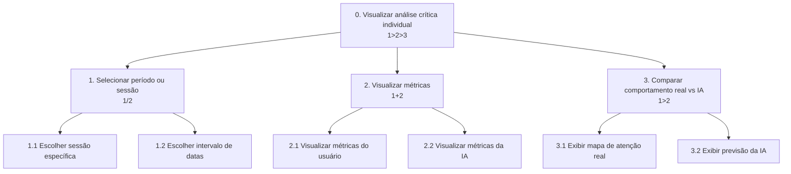

## Dashboard Individual


```mermaid
graph TD

A["0. Visualizar análise crítica individual
1>2>3"]

A --> B["1. Selecionar período ou sessão
1/2"]

A --> C["2. Visualizar métricas
1+2"]

A --> D["3. Comparar comportamento real vs IA
1>2"]

B --> B1["1.1 Escolher sessão específica"]
B --> B2["1.2 Escolher intervalo de datas"]

C --> C1["2.1 Visualizar métricas do usuário"]
C --> C2["2.2 Visualizar métricas da IA"]

D --> D1["3.1 Exibir mapa de atenção real"]
D --> D2["3.2 Exibir previsão da IA"]

```

## Dashboard de interações no software

```mermaid

```
