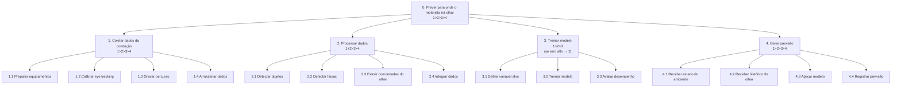

```mermaid
graph TD

A["0. Prever para onde o motorista irá olhar
1>2>3>4"]

A --> B["1. Coletar dados da condução
1>2>3>4"]

A --> C["2. Processar dados
1+2>3>4"]

A --> D["3. Treinar modelo
1>2>3
(se erro alto → 2)"]

A --> E["4. Gerar previsão
1>2>3>4"]

%% Coleta
B --> B1["1.1 Preparar equipamentos"]
B --> B2["1.2 Calibrar eye tracking"]
B --> B3["1.3 Gravar percurso"]
B --> B4["1.4 Armazenar dados"]

%% Processamento
C --> C1["2.1 Detectar objetos"]
C --> C2["2.2 Detectar faixas"]
C --> C3["2.3 Extrair coordenadas do olhar"]
C --> C4["2.4 Integrar dados"]

%% Modelagem
D --> D1["3.1 Definir variável alvo"]
D --> D2["3.2 Treinar modelo"]
D --> D3["3.3 Avaliar desempenho"]

%% Predição
E --> E1["4.1 Receber estado do ambiente"]
E --> E2["4.2 Receber histórico do olhar"]
E --> E3["4.3 Aplicar modelo"]
E --> E4["4.4 Registrar previsão"]

```
