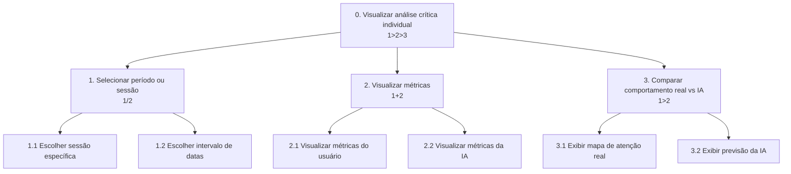
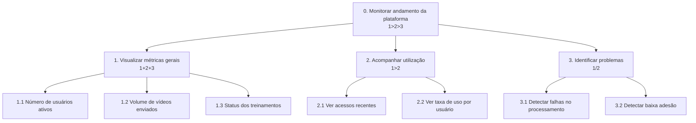
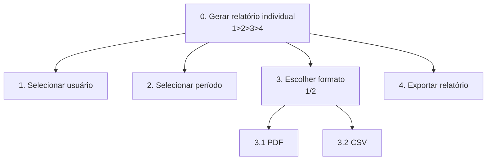
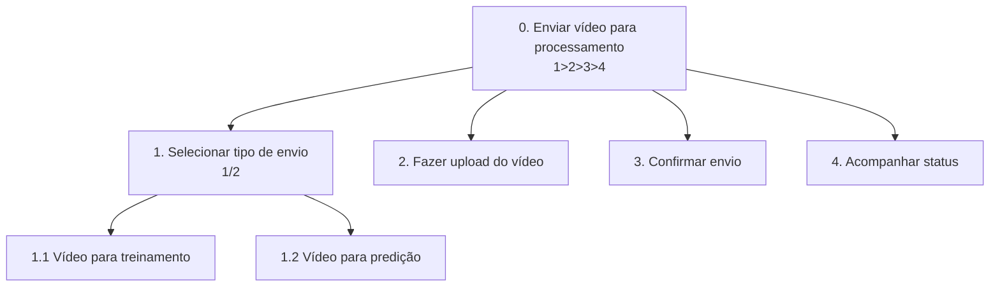

1️⃣ Dashboard de Análise Crítica Individual

🎯 Objetivo

Permitir que o usuário visualize e compare seu comportamento real com a predição da IA.

--------

2️⃣ Dashboard do Administrador

🎯 Objetivo

Monitorar o andamento e utilização da plataforma.

------

3️⃣ Extração de Relatório Individual

🎯 Objetivo

Gerar relatório de desempenho do usuário.

----------

4️⃣ Envio de Vídeo para Treinamento ou Predição

🎯 Objetivo

Enviar vídeo para processamento na plataforma.

