# Mapa de objetivos

O **mapa de objetivos** organiza, de cima para baixo, o que o usuário precisa alcançar ao usar o BVRAI: primeiro o objetivo global, depois subobjetivos e operações de alto nível (Barbosa e Silva, 2010). No projeto de referência, o diagrama é apresentado como figura vetorial; aqui equivalente é dado em **Mermaid** (hierarquia + planos textuais).

---

## Diagrama (hierarquia de objetivos)

```mermaid
flowchart TB
  O0(["0. Obter insumo confiável sobre atenção visual a partir de vídeo"])

  O1(["1. Garantir que o vídeo certo entre no pipeline no modo adequado"])
  O2(["2. Acompanhar o processamento até resultado disponível"])
  O3(["3. Interpretar a saída sem confundir estimativa com julgamento normativo"])
  O4(["4. Documentar, exportar e comunicar resultados conforme o contexto"])

  O0 --> O1
  O0 --> O2
  O0 --> O3
  O0 --> O4

  O1 --> O1a["1.1 Autenticar no perfil correto motorista ou admin"]
  O1 --> O1b["1.2 Escolher treino ou predição"]
  O1 --> O1c["1.3 Anexar arquivo e confirmar envio"]
  O1 --> O1d["1.4 Verificar estado na fila pessoal ou global"]

  O2 --> O2a["2.1 Ler selos Na fila Processando Concluído"]
  O2 --> O2b["2.2 Correlacionar com registro de job no servidor quando integrado"]

  O3 --> O3a["3.1 Selecionar sessão e recorte temporal"]
  O3 --> O3b["3.2 Ativar camadas real IA e sobreposição"]
  O3 --> O3c["3.3 Ler métricas agregadas da barra inferior"]

  O4 --> O4a["4.1 Definir escopo do relatório eu sessão período"]
  O4 --> O4b["4.2 Escolher PDF ou CSV"]
  O4 --> O4c["4.3 Em frota usar KPIs e exportações administrativas"]
```

---

## Planos de realização (notação resumida)

| Nó | Plano sugerido | Comentário |
| :--- | :--- | :--- |
| **1** | `1.1 → 1.2 → 1.3 → 1.4` | Sequência típica do motorista na primeira subida de arquivo. |
| **2** | `2.1` repetido até `2.2` | Monitoramento pode ser intercalado com outras tarefas (*multitasking*). |
| **3** | `(3.1 + 3.2) → 3.3` | Ajuste de filtros e camadas pode ser feito em qualquer ordem, depois leitura das métricas. |
| **4** | `4.1 → 4.2` ou `4.3` | Motorista/pesquisa priorizam 4.1–4.2; gestão prioriza 4.3 em paralelo. |

---

## Leitura do mapa por persona (atalhos cognitivos)

| Persona / papel | Atalho típico no grafo |
| :--- | :--- |
| **Motorista** | Entra forte em **1** e **3**, usa **4.1–4.2** para arquivo “bonito” ou CSV pessoal. |
| **Frota / admin** | Pula direto para **1.4** na visão global e **4.3** para agregar indicadores. |
| **Pesquisa** | Itera **3.1** várias vezes (sessões diferentes) antes de **4.2** (CSV para análise). |
| **Produto** | Percorre **0 → 4** validando rótulos e consistência de promessa em **Sobre** e abas. |

---

## Relação com o protótipo

Os nós **1.x** correspondem à aba **Vídeos** e à autenticação; **2.x** à lista de status; **3.x** a **Minha análise**; **4.x** a **Relatórios** e, no caso **4.3**, também **Administração** e estatísticas de **Início** (perfil admin). Quando o *backend* persistir estados no **MySQL**, o nó **2.2** passa a ter *feedback* explícito na UI (identificador de *job*, horário de conclusão).

---

*Referência: BARBOSA, S. D. J.; SILVA, B. S. **Interação Humano-Computador**. Elsevier, 2010.*
